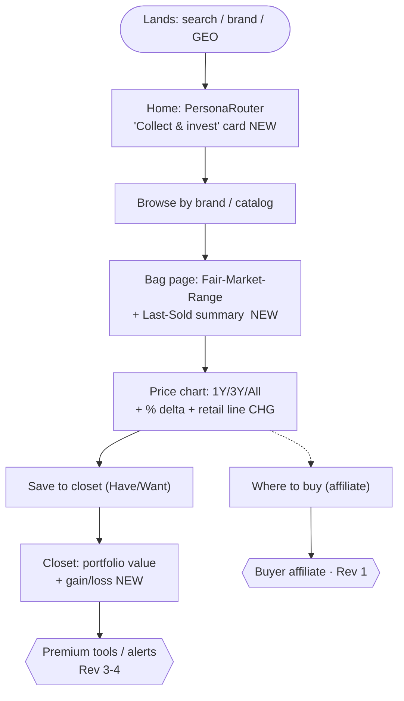
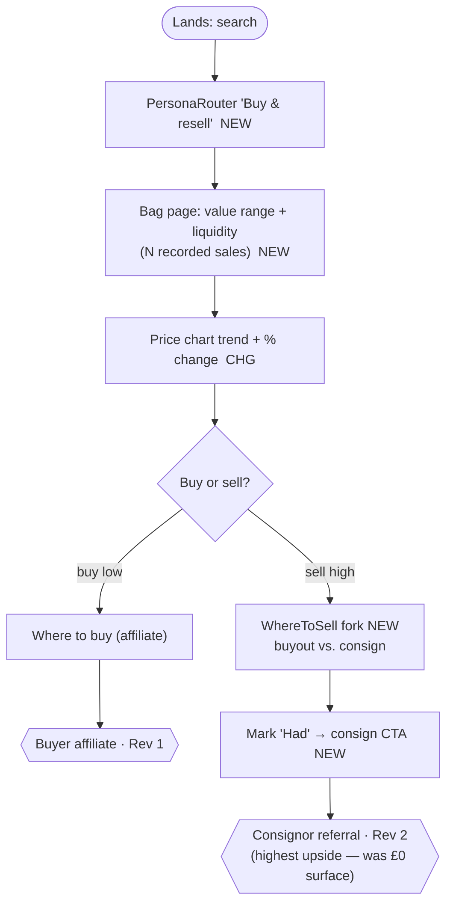
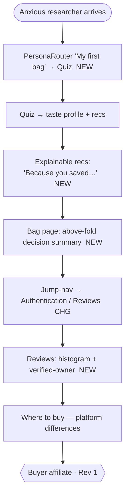
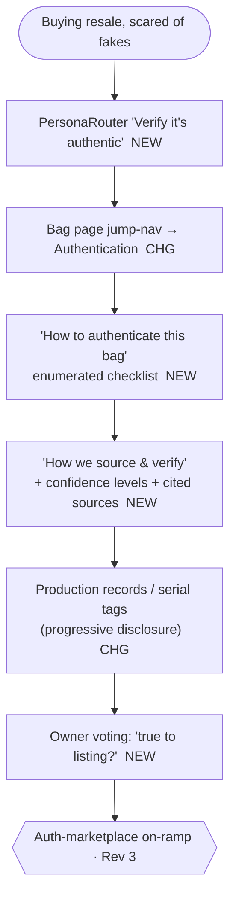
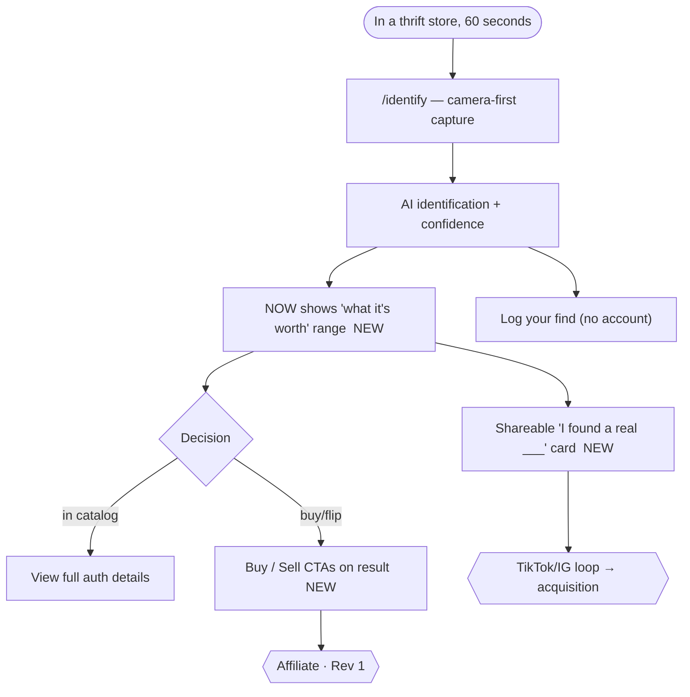

# Sitemap & User-Story Flows (post-UX-overhaul)

> View this on GitHub — the Mermaid diagrams render automatically. It shows the
> updated site structure and how each of the five user stories now moves through
> the product after the UX work. **NEW** = added by this overhaul · **CHANGED** =
> reworked surface. Nothing here has been runtime click-tested (no Supabase creds
> in this environment); it reflects the implemented code and the specs in
> `docs/ux/ux-evaluation.md`.

---

## 1. Sitemap

### 1a. Crawlable `sitemap.xml` (what search engines + AI crawlers see)
Generated by `src/app/sitemap.ts`. Static routes + programmatic per-entity routes:

```
https://<site>/                       priority 1.0   (home)
https://<site>/search                 0.7
https://<site>/identify               0.6
https://<site>/quiz                   0.6   ← NEW in sitemap
https://<site>/closets                0.6   ← NEW in sitemap
https://<site>/found                  0.5   ← NEW in sitemap
https://<site>/posts                  0.7
https://<site>/posts/{slug}           0.7   × every published article
https://<site>/brand/{id}             0.6   × every brand
https://<site>/bag/{id}               0.8   × every bag variant   (the GEO asset)
```
The three NEW entries put the now-primary entry points (taste quiz, the coveted-
closets leaderboard, the public thrift log) into the crawl graph — consistent with
the marketing-plan GEO strategy.

### 1b. Full application route tree (annotated)

```
/                                  CHANGED  home: + PersonaRouter, + Explore strip
├── /search                        CHANGED  + faceted filters & sort
├── /identify                      CHANGED  + value range + buy/sell CTA + share card
├── /quiz                          (find-your-taste; now surfaced in nav + home)
├── /found                         (thrift log; surfaced in Explore strip)
├── /recap                         NEW      "Year in Bags" shareable recap
│
├── /bag/[variantId]               CHANGED  decision-point overhaul:
│      · Fair-Market-Range + Last-Sold summary (above the fold)
│      · sticky action bar (Save · Watch · Buy · Sell)
│      · WhereToSell fork (buyout vs. consign)   ← NEW revenue surface
│      · jump-nav + collapsible deep sections
│      · price chart: range toggles + % delta + retail line
│      · "How to authenticate" + "how we verify" module
│      · reviews distribution histogram + verified-owner badge
│      · attribute cross-links (brand/material/hardware/year → search)
│      · multi-axis owner voting (build quality / holds value / worth-it)
├── /brand/[brandId]
├── /browse/carry/[carryType]
├── /browse/fits/[item]
│
├── ACCOUNT
│   ├── /closet                    CHANGED  + collection value / portfolio total
│   ├── /watchlist                 (now surfaced in nav)
│   ├── /profile                   CHANGED  + Four Grails picker
│   │   ├── /profile/edit
│   │   ├── /profile/reviews
│   │   └── /profile/posts
│   ├── /settings
│   ├── /onboarding                (persona capture → hands off to quiz)
│   ├── /notifications
│   ├── /login  /signup
│
├── SOCIAL / DISCOVERY
│   ├── /u/[handle]                CHANGED  + Four Grails display
│   ├── /closets                   (coveted-closets leaderboard; + top reviewers)
│   ├── /feed
│   ├── /posts  /posts/[slug]  /posts/new  /posts/[slug]/edit
│
├── ADMIN (gated)
│   └── /admin · /feedback · /requests · /corrections · /searched-not-found
│
└── SEO  /sitemap.xml (updated)  ·  /robots.txt
```

---

## 2. User-story flows

Each flow walks **entry → discovery → research → decision → return**. New
touchpoints are tagged `NEW`/`CHG`. The right-most node is the monetization arrow
the journey now lands on.

### 2.1 Serious collector / investor — *"is this a good position?"*


### 2.2 Resale flipper — *the journey that previously dead-ended*


### 2.3 First serious purchase — *"will it last / is it worth it?"*


### 2.4 Authentication-paranoid buyer — *"how do I know it's real?"*


### 2.5 Thrift / estate hunter — *the viral engine, now monetized*


---

## 3. Before → after, at a glance

| Surface | Before | After |
|---|---|---|
| **Home** | Generic hero + browse | + Persona router (5 use cases) + Explore strip |
| **Nav** | Quiz/Watchlist hidden | Quiz + Watchlist surfaced; mobile-scrollable |
| **Bag page** | CTAs buried below ~18 sections; no value; buy-only | Above-fold value range + sticky bar; **Where-to-sell**; jump-nav; chart toggles; auth checklist; review histogram; attribute links; owner voting |
| **Identify** | ID only, no value, no CTA | Value range + buy/sell CTAs + shareable card |
| **Search** | Brand/style cards only | Faceted filters + sort |
| **Closet** | List, retail only | + Portfolio value / gain-loss |
| **Profile / public** | Flat link wall | + Four Grails identity badge |
| **New** | — | `/recap` Year-in-Bags · top-reviewers board · sitemap +quiz/closets/found |

> **Revenue arrows now surfaced that previously had no UX:** consignor referral
> (Rev 2 — highest upside) via Where-to-sell + `Had` flow; auth-marketplace on-ramp
> (Rev 3) via the authentication module + owner voting; premium hooks (Rev 3-4) via
> portfolio value + alerts.
>
> **Caveat:** the Four-Grails and owner-voting features depend on migrations
> `0011`/`0012`, which are **human-gated** (apply + smoke-test before merge, per
> `docs/handoff.md`).
